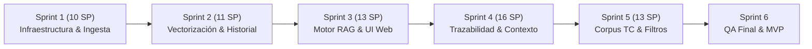

# Inti - Asistente Jurídico Inteligente (RAG)
> **Sistema de Gestión de Proyecto de Software — Metodología Ágil (Scrum / Kanban)**  
> **Curso:** Gestión de Proyectos de Software — UNSA (2026-B)  
> **Docente:** Ing. Diego Iquira Becerra  
> **Integrantes:**  
> * Rodrigo Alexander Fernandez Huarca  
> * Rafael Diego Nina Calizaya  
> * Jorge Luis Mamani Arias  
> * Jhon Alexander Quispe Apaza  
> 
> 🚀 **Tablero del Proyecto (GitHub Projects):** [Inti - Asistente Jurídico (Kanban & Backlog)](https://github.com/users/JhonAQ/projects/6)

---

## 📌 1. Visión y Alcance Operativo del Producto

**Inti** es un asistente jurídico inteligente basado en arquitectura **RAG (Retrieval-Augmented Generation)** enfocado en la comunidad académica y estudiantes de Derecho de la Universidad Nacional de San Agustín (UNSA).

### Problemática Resuelta (AS-IS vs. TO-BE)
* **AS-IS:** La búsqueda jurídica manual toma entre 30 y 90 minutos por consulta compleja debido a dispersión de fuentes (SPIJ, Tribunal Constitucional, repositorios) y altas tasas de alucinación en IAs comerciales generalistas (40-50%).
* **TO-BE:** Inti reduce el tiempo a 1–3 minutos (~95% de mejora) con respuestas trazables, enlaces directos a la legislación oficial del SPIJ y una tasa de alucinación menor al 5%.

### Componentes Arquitecturales
1. **Módulo de Ingesta:** Extracción y preprocesamiento de textos legales oficiales (SPIJ y jurisprudencia del TC).
2. **Pipeline de Embeddings:** Segmentación jerárquica (*chunking* por Libro, Título y Artículo) y vectorización vía API (`text-embedding-3-small`).
3. **Base de Datos:** PostgreSQL con extensión `pgvector` en Supabase (datos relacionales y vectores semánticos unificados).
4. **Motor RAG:** Búsqueda híbrida (semántica + keywords) orquestada con LlamaIndex y generación mediante Groq (Llama 3.3).
5. **Backend API:** FastAPI con soporte de endpoints REST y streaming en tiempo real.
6. **Frontend Web:** Interfaz responsiva moderna con citas directas estructuradas.

---

## 📋 2. Product Backlog Priorizado (MoSCoW)

El Product Backlog consta de **12 Requerimientos Funcionales/Historias de Usuario** priorizadas mediante el marco MoSCoW, asegurando un alcance factible de 63 Story Points para un ciclo de 12 semanas (6 Sprints):

| ID | Historia de Usuario | Prioridad MoSCoW | Componente | SP | Milestone / Sprint |
| :--- | :--- | :---: | :--- | :---: | :--- |
| **HU-01** | [Consulta en lenguaje natural con respuesta contextualizada](https://github.com/jorghee/software-project-management/issues/1) | **Must Have** | Motor RAG | 8 | Sprint 3 |
| **HU-02** | [Trazabilidad de citas con enlace directo a la fuente oficial](https://github.com/jorghee/software-project-management/issues/2) | **Must Have** | Motor RAG | 8 | Sprint 4 |
| **HU-03** | [Ingesta automatizada de normativa desde el SPIJ](https://github.com/jorghee/software-project-management/issues/3) | **Must Have** | Ingesta / DB | 13 | Sprint 1 & 2 |
| **HU-04** | [Ingesta de jurisprudencia del Tribunal Constitucional](https://github.com/jorghee/software-project-management/issues/4) | **Should Have** | Ingesta | 8 | Sprint 5 |
| **HU-05** | [Registro y autenticación de usuarios institucional UNSA](https://github.com/jorghee/software-project-management/issues/5) | **Must Have** | Backend / Auth | 5 | Sprint 1 |
| **HU-06** | [Historial de consultas por usuario](https://github.com/jorghee/software-project-management/issues/6) | **Could Have** | Base de Datos | 3 | Sprint 2 |
| **HU-07** | [Preguntas de seguimiento con retención de contexto conversacional](https://github.com/jorghee/software-project-management/issues/7) | **Should Have** | Motor RAG | 8 | Sprint 4 |
| **HU-08** | [Interfaz adaptada a dispositivos móviles (Web responsiva)](https://github.com/jorghee/software-project-management/issues/8) | **Could Have** | Frontend | 5 | Sprint 3 |
| **HU-09** | [Panel de monitoreo de ingesta de datos (administrador)](https://github.com/jorghee/software-project-management/issues/9) | **Could Have** | Backend | 5 | Sprint 5 |
| **HU-10** | [Exportación de consultas y citas legales a formato estructurado](https://github.com/jorghee/software-project-management/issues/10) | **Could Have** | Frontend | 3 | Sprint 4 |
| **HU-11** | [Calificación y retroalimentación de respuestas generadas](https://github.com/jorghee/software-project-management/issues/11) | **Could Have** | Backend | 3 | Sprint 5 |
| **HU-12** | [Filtrado previo por rama jurídica (Civil, Penal, Constitucional)](https://github.com/jorghee/software-project-management/issues/12) | **Should Have** | Motor RAG | 5 | Sprint 5 |

### 🚫 Exclusiones Explícitas del MVP (Won't Have)
* **Aplicación móvil nativa (Android / iOS):** Cobertura garantizada vía Web Responsiva ([HU-08]).
* **Integración automatizada con el sistema CEJ del Poder Judicial:** Bloqueado por Captcha y DNI obligatorio en portal oficial.
* **OCR masivo de resoluciones anteriores a 2004:** Alto consumo computacional y necesidad de transcripción manual fuera de plazo.

---

## ⏱️ 3. Planificación y Métricas Ágiles

* **Equipo:** 4 ingenieros de software.
* **Dedicación:** 8 hrs/semana/persona = 32 hrs/semana = **64 hrs de ingeniería por Sprint (2 semanas)**.
* **Plazo Total:** 12 semanas (**6 Sprints de 2 semanas**).
* **Volumen Total del Backlog:** 63 Story Points (SP).
* **Velocidad de Equipo Requerida:** $63\text{ SP} / 6\text{ Sprints} = \mathbf{10.5\text{ SP / Sprint}}$.

### Estimación por Secuencia de Fibonacci Modificada
Evaluada objetivamente en base a tres dimensiones: **Volumen de trabajo**, **Complejidad técnica** e **Incertidumbre/Riesgo**, tomando una historia pivote base de **3 SP** (CRUD estándar).

### Roadmap de Sprints

---

## 📊 4. Tablero Kanban y Políticas de Flujo

El flujo de trabajo en GitHub Projects está regulado bajo las siguientes políticas:

### Columnas y Límites WIP (Work In Progress)
1. **📋 Product Backlog:** Requerimientos e historias registradas pendientes de refinamiento.
2. **🎯 Ready (DoR Cumplido):** Historias refinadas con criterios Given-When-Then y estimadas en Story Points.
3. **⏳ Sprint Backlog:** Tareas técnicas atomizadas asignadas al Sprint activo.
4. **⚙️ In Progress (WIP Limit: 4):** Máximo una tarea técnica activa por integrante del equipo.
5. **🔍 In Review / QA (WIP Limit: 3):** Pull Request abierto, revisión entre pares y verificación funcional.
6. **✅ Done (DoD Cumplido):** Tarea integrada en `main`, probada y validada contra criterios de aceptación.

### Definition of Ready (DoR)
Para que una Historia de Usuario pase a planificarse en un Sprint debe cumplir:
* [x] Formato estructurado *Como [rol], quiero [acción], para [beneficio]*.
* [x] Escenarios de aceptación expresados en sintaxis *Given-When-Then*.
* [x] Estimación asignada en Story Points mediante consenso.
* [x] Dependencias técnicas y arquitecturales identificadas.

### Definition of Done (DoD)
Para que una tarea se considere completada:
* [x] Código probado con tests unitarios / de integración pasando.
* [x] Formateo y tipado sin errores de linter.
* [x] Aprobación de Pull Request por al menos un revisor del equipo.
* [x] Criterios de aceptación verificados en el entorno de despliegue.

---

## 🛠️ 5. Sprint 1 Activo: Desglose de Tareas Técnicas Atomizadas

Para el **Sprint 1** (10 SP), las historias comprometidas se han atomizado en tareas de 2 a 6 horas:

* **HU-05: Autenticación de Usuarios (5 SP)**
  - `[TASK-05.1]` Modelado de tablas y RLS en Supabase (3 hrs)
  - `[TASK-05.2]` Endpoints FastAPI de Registro y Login JWT con filtro `@unsa.edu.pe` (4 hrs)
  - `[TASK-05.3]` Maquetación de pantallas de Login y Registro responsivas (4 hrs)
  - `[TASK-05.4]` Integración de frontend con API y persistencia de sesión (3 hrs)
  - `[TASK-05.5]` Pruebas unitarias de flujo de autenticación (2 hrs)
* **HU-03: Ingesta SPIJ - Fase 1 (5 SP)**
  - `[TASK-03.1]` Script de descarga automatizada del Código Civil desde SPIJ (6 hrs)
  - `[TASK-03.2]` Limpieza y normalización de texto jurídico HTML (3 hrs)
  - `[TASK-03.3]` Algoritmo de chunking jerárquico por Libro/Título/Artículo (5 hrs)
  - `[TASK-03.4]` Pruebas de cobertura y validación de artículos extraídos (3 hrs)
